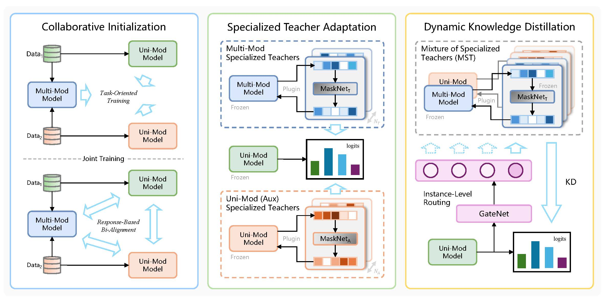

# MST-Distill

**Paper**: [MST-Distill: Mixture of Specialized Teachers for Cross-Modal Knowledge Distillation](https://ieeexplore.ieee.org/document/11006507)

**Published in**: ACM Multimedia 2025  

---

## 🎯 Overview

MST-Distill addresses the key challenges of path selection and knowledge drift in cross-modal knowledge distillation by constructing diverse teacher model ensembles, implementing instance-level dynamic distillation through routing networks, and employing feature masking networks to suppress modality discrepancies, significantly improving knowledge transfer quality across different modalities.



---

## 📋 Requirements

**Main Dependencies:**

- Python >= 3.9
- PyTorch >= 2.1

All experiments are conducted on a server equipped with an Intel Xeon Gold 6248R CPU and an NVIDIA A100 GPU.

Noting that the results may be still not the same among different implement devices. See [randomness@Pytorch Docs](https://pytorch.org/docs/stable/notes/randomness.html).

---

## 🚀 Quick Start

### 1. Dataset Preparation

Download and prepare the datasets:

- **AV-MNIST**: Visual-audio digit classification
- **RAVDESS**: Visual-audio emotion recognition
- **VGGSound-50k**: Visual-audio scene classification
- **CrisisMMD-V2**: Image-text humanitarian classification
- **NYU-Depth-V2**: RGB-depth semantic segmentation

### 2. Cross-modal Knowledge Distillation

Our method:

```python
# Example for RAVDESS dataset (target modality: visual)
python main-MST-Distill.py --database RAVDESS --batch_size 32 --mode m1 --Tmodel 'DSCNN-I' --Smodel 'VisualBranchNet' --AUXmodel 'AudioBranchNet'
```

Other method that needs pre-trained teacher model:
If you want to run other CMKD method, you might need to obtain the ore-trained teacher model first.

1. Teacher model training:

   ```python
   # MM Teacher
   python main-T.py --database RAVDESS --batch_size 32 --mode m1 --Tmodel 'DSCNN-I'
   
   # CM Teacher
   python main-S.py --database RAVDESS --batch_size 32 --mode m2 --Smodel 'AudioBranchNet'
   ```

2. CMKD method:
   
